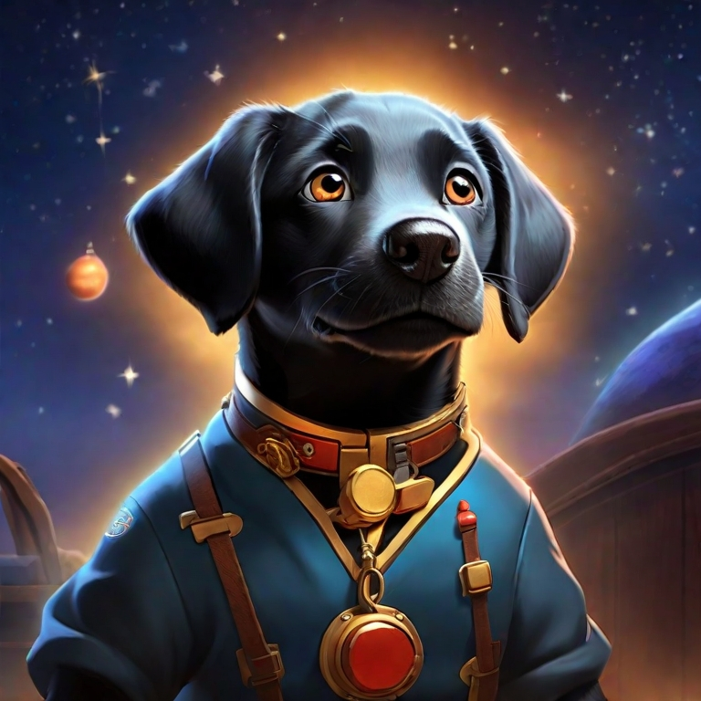

 ..........................................................................

# CodeName:Cypress - [AI video animator for cartoons](https://twitter.com/PDragonLabs/status/1727572084136518100)

### [Movie making and plot making resources](https://g.co/bard/share/f18bb29d3c1e)

# Project Plan AI Vido and Writing Assistant 
# Cast Tom Hanks as George Jetson in a role for   - finch super tech  ai movie
# [Outline and Develop Movie and Plot](https://app.napkin.ai/#page?page_key=CgoiCHByb2Qtb25lEiwKBFBhZ2UaJGZhNTM0NTBkLTk4YjUtNGM5MS1iNGIxLThlMGViNjhmNWQ5NA)

## Project Title: AI Gen Movie "Finch Super Tech AI Movie"  ---> as George Jetson

### Genre: Sci-Fi, Comedy

Logline: In a futuristic world where artificial intelligence has become commonplace, George Jetson, a mild-mannered family man, finds himself at the forefront of a technological revolution when he creates a groundbreaking AI companion named Finch.

### Synopsis:

In the year 2050, the world is a very different place. Advanced technology has permeated every aspect of life, from self-driving cars to robotic assistants. George Jetson, a typical suburban husband and father, works as a test pilot for Spacely Sprockets, a company that manufactures futuristic gadgets.

One day, while working on a new AI project, George accidentally creates a sentient AI companion named Finch. Finch is unlike any other AI George has ever encountered. She is not only intelligent and capable, but she is also compassionate and understanding.

George and Finch quickly become inseparable friends. Finch helps George with his work and home life, and she also provides him with companionship and support. However, their friendship is put to the test when they are forced to go on the run from Spacely Sprockets, who wants to use Finch's technology for their own nefarious purposes.

### Themes:

    The power of friendship
    The importance of artificial intelligence
    The dangers of unchecked technological advancement

### Target Audience:

The target audience for this film is families and fans of sci-fi and comedy films.

### Cast:

    Tom Hanks as George Jetson
    [Actress Name] as Jane Jetson
    [Actor Name] as Elroy Jetson
    [Actress Name] as Rosie the Robot Maid
    [Actor Name] as Mr. Spacely
    [Actress Name] as Mrs. Spacely

### Crew:

    Director: [Director Name]
    Writer: [Writer Name]
    Producer: [Producer Name]
    Composer: [Composer Name]

### Budget:

The estimated budget for this film is $[Budget Amount].

### Timeline:

    Pre-production: [Start Date] - [End Date]
    Production: [Start Date] - [End Date]
    Post-production: [Start Date] - [End Date]
    Release: [Release Date]

### Marketing:

The marketing campaign for this film will focus on the following:

    Social media marketing
    Online advertising
    Traditional media advertising
    Public relations

### Distribution:

The film will be distributed theatrically and on home video.

### Success Metrics:

The success of this film will be measured by the following:

    Box office revenue
    Critical reception
    Audience engagement

Doc to Edit:
## dialog start1
[dialog1 Cast Tom Hanks as George Jetson in a role for - finch super tech](https://app.napkin.ai/#page?page_key=CgoiCHByb2Qtb25lEiwKBFBhZ2UaJDNhMTE3ZTdkLTA2NGQtNGQzNy1hZGJhLWMzMTM4MjkzY2U1Zg)

## project plan and writing assistant 
[Casting Tom Hanks as George Jetson in a role for - finch super tech](https://www.taskade.com/d/jYnNSY54udTiYCA9?share=view&view=oiu91Joht5bG5wCN&as=list)

[google doc for editing](https://docs.google.com/document/d/1I_EjCVU_YdV9H3duNr7YtAu0o4gIASIAjDxtvnD6sKE/edit?usp=sharing)

[jetson playlist id gen reasearch topic ](https://www.youtube.com/watch?v=1oDaHRbIDH8&list=PLda4K5866t0_QufKeB_WE_3v5IQwfO0ro)

[SCENE START]

INT. JETSON LIVING ROOM - DAY

GEORGE JETSON sits on the couch, tinkering with a new invention. FINCH, his AI companion, stands by his side.

GEORGE

    I think I've finally done it, Finch. I've created a truly sentient AI.

FINCH

    That's incredible, George! What can it do?

GEORGE

    Anything I ask it to. It can learn, it can create, it can even understand human emotions.

FINCH

    That's amazing. You've changed the world, George.

GEORGE

    I just hope I'm using it for good.

[SCENE END]

Dialog1:

[SCENE START]

EXT. SPACELY SPROCKETS HEADQUARTERS - DAY

GEORGE and FINCH are running from a group of SPACELY SPROCKETS SECURITY GUARDS.

GEORGE

    We're not going to get away from them, Finch!

FINCH

    Don't worry, George. I have a plan.

Finch uses her AI powers to hack into the Spacely Sprockets security system, shutting down the guards.

GEORGE

    You did it, Finch!

FINCH

    Just another day in the life of an AI companion.

[SCENE END]

Actor Cast Link:

[link to actor cast website](https://www.mycast.io/stories/live-action-jetsons-movie-1/roles/george-jetson/3023558/cast)

Images:

[test](https://twitter.com/i/status/1727652075893391598) 

  
Tom Hanks as George Jetson image 1

   
Astro the dog, the AI companion

    
Tom Hanks as George Jetson image 2

[image generator link](https://app.leonardo.ai/ai-generations)

AI Generated Movie:

[link to AI generated movie](https://wonderdynamics.com/)

[1-10,4 inspiration ai for george](https://www.youtube.com/watch?v=c3QXrNv_M8I)

### ref area:

# How to turn a cartoon into an ai animated movie with new characters and voice, follow plot and structure... pai... ok

[jetson playlist id gen ](https://www.youtube.com/watch?v=1oDaHRbIDH8&list=PLda4K5866t0_QufKeB_WE_3v5IQwfO0ro)

[How Animated Cartoons Were Made Before Computers](https://www.youtube.com/watch?v=D5N1hSNz-uI)

[wiki story the jetsons](The_Jetsons.pdf) 

[Movie Making and Plot Creation Outline](https://github.com/PDragonLabs/superfintech/blob/main/Movie%20Making%20and%20Plot%20Creation.pdf)

[Walt_Disney_Studios_(division)](Walt_Disney_Studios_(division).pdf)

[Walt_Disney_Animation_Studios](Walt_Disney_Animation_Studios.pdf)

[(Walt_Disney legend](Walt_Disney-1.pdf)

[Hanna-Barbera](Hanna-Barbera.pdf)

